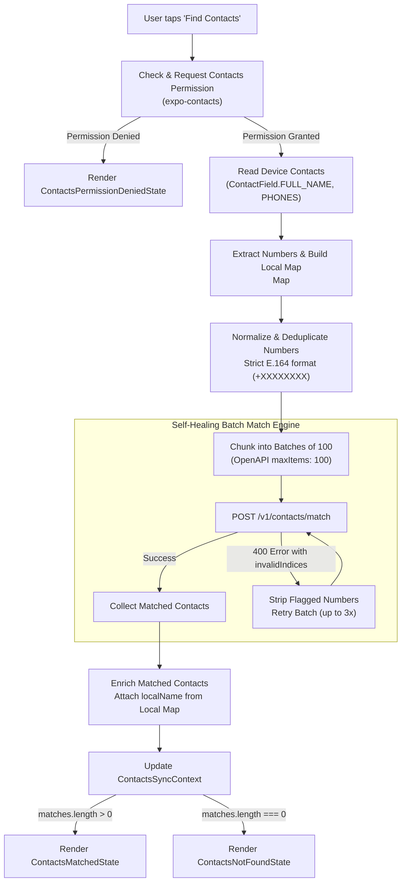

# Contact Discovery & Synchronization Architecture

## Table of Contents & Code References

| Concept / Topic | Description | Code Implementation |
| :--- | :--- | :--- |
| **Phone Number Normalization** | Cleaning raw phone inputs, handling country prefixes, domestic trunk zeros, and enforcing strict E.164 formatting | [`normalizePhoneNumber` in `src/features/contacts/utils/phoneUtils.ts`](../src/features/contacts/utils/phoneUtils.ts#L33-L99) |
| **Country Code Extraction & Fallback** | Inferring the country dial code from the logged-in user's profile with default fallback | [`extractCountryCode` in `src/features/contacts/utils/phoneUtils.ts`](../src/features/contacts/utils/phoneUtils.ts#L14-L20) |
| **Batching & Schema Constraints** | Splitting large phone lists into chunks of 100 to comply with OpenAPI `maxItems: 100` | [`useMatchContacts` in `src/features/contacts/api/useMatchContacts.ts`](../src/features/contacts/api/useMatchContacts.ts#L112-L138) |
| **Self-Healing API Retry** | Intercepting server-flagged `invalidIndices`, stripping invalid numbers, and retrying seamlessly | [`sendBatchWithRetry` in `src/features/contacts/api/useMatchContacts.ts`](../src/features/contacts/api/useMatchContacts.ts#L35-L99) |
| **Sync Lifecycle & Permissions** | Orchestrating OS permissions, device phonebook querying, normalization, and API matching | [`useSyncContacts` in `src/features/contacts/hooks/useSyncContacts.ts`](../src/features/contacts/hooks/useSyncContacts.ts#L37-L144) |
| **Local Name Enrichment & Privacy** | Preserving user privacy by never uploading contact names, then mapping local names locally | [`phoneToLocalName` Map in `src/features/contacts/hooks/useSyncContacts.ts`](../src/features/contacts/hooks/useSyncContacts.ts#L88-L135) |
| **React Context & Dependency Injection** | Providing global sync state and allowing partial value overrides for mocking and testing | [`ContactsSyncProvider` in `src/features/contacts/context/ContactsSyncContext.tsx`](../src/features/contacts/context/ContactsSyncContext.tsx#L40-L64) |
| **State Machine & Compound Components** | Rendering discrete UI states (Syncing, Matched, NotFound, Denied, Prompt) with zero prop boilerplate | [`ContactsEmptyState` in `src/features/contacts/components/ContactsEmptyState.tsx`](../src/features/contacts/components/ContactsEmptyState.tsx#L25-L77) |

---

## Architecture Overview

When a user opens WhatsApp, they expect to immediately see which of their friends are already on the platform. Achieving this requires coordinating native device permissions, hardware phonebook storage, string normalization, rate-limited and schema-constrained API endpoints, and reactive UI states.

### End-to-End Workflow Diagram



---

## 1. Phone Number Normalization (`phoneUtils.ts`)

### Why Normalization Is Required
Phone numbers in real-world address books are saved inconsistently:
- `+234 801 234 5678` (Formatted with international dial code and spaces)
- `08012345678` (Local Nigerian format with domestic trunk zero `0`)
- `8012345678` (Local format without domestic trunk zero)
- `(080) 123-4567` (Formatted with parentheses and hyphens)
- `2348012345678` (Country code included, but missing the `+` prefix)
- `002348012345678` (Using international exit prefix `00` instead of `+`)
- `*123#` or `180 MTN` (USSD service codes and carrier customer service contacts)

If raw numbers are sent directly to the database query (`SELECT * FROM users WHERE phone_number = ?`), matches will fail because the backend stores phone numbers strictly in international **E.164** format (`+[country_code][subscriber_number]`).

### How It Works

#### Step 1: Reject Non-Phone Strings
Inputs containing USSD characters (`*`, `#`) or alphabetic letters are discarded immediately:
```typescript
if (/[*#a-zA-Z]/.test(rawNumber)) return null;
```

#### Step 2: Strip Formatting Characters & Convert `00`
All spaces, dashes, parentheses, and dots are removed. If the number uses the European/GSM international exit code `00`, it is converted to `+`:
```typescript
let cleaned = rawNumber.trim().replace(/[\s\-().]/g, "");
if (cleaned.startsWith("00")) {
  cleaned = "+" + cleaned.slice(2);
}
```

#### Step 3: Dynamic Fallback Country Code
If a contact was saved locally as `08012345678`, there is no country code attached. To make it E.164, we need to know what country code to assume:
1. First, check if a custom `fallbackCountryCode` was provided.
2. Second, inspect the logged-in user's own phone number in the Zustand auth store (`useAuthStore.getState().user?.phoneNumber`) using `extractCountryCode()`. If the user has a `+234` number, their local address book contacts are almost certainly Nigerian numbers.
3. Third, default to `+234` (Nigeria).

#### Step 4: Formatting Candidates
- **Already has `+`**: Keep `+` and strip any lingering non-digits.
- **Has country code without `+` (e.g. `234801...`)**: Prepend `+`.
- **Has domestic trunk `0` (e.g. `0801...`)**: Remove the leading `0` and prepend the country code: `+234801...`.
- **Local without trunk (e.g. `801...`)**: Prepend the country code directly: `+234801...`.

#### Step 5: Country-Specific Validation (Nigeria `+234`)
For Nigerian numbers, mobile network operators (MTN, Airtel, Glo, 9mobile) strictly use 10 digits after `+234`, beginning with `7`, `8`, or `9` (`070...`, `080...`, `081...`, `090...`, `091...`):
```typescript
if (e164Candidate.startsWith("+234")) {
  const digitsAfter234 = e164Candidate.slice(4);
  if (!/^[789]\d{9}$/.test(digitsAfter234)) {
    return null;
  }
}
```

#### Step 6: Deduplication
`normalizePhoneNumbers()` uses a `Set<string>` to guarantee that duplicates (e.g., when a person is saved under both SIM and Google accounts, or listed with both Work and Mobile tags) are stripped before making API calls.

---

## 2. API Batching & Self-Healing Retry (`useMatchContacts.ts`)

### Why Batching Is Required
The OpenAPI schema for the backend endpoint `/v1/contacts/match` specifies:
```json
"phoneNumbers": {
  "type": "array",
  "items": { "type": "string" },
  "maxItems": 100
}
```
If an address book contains 450 contacts, submitting all 450 in one request causes an immediate `400 Bad Request` schema validation rejection.
`useMatchContacts` chunks the array into batches of at most 100:
```typescript
for (let i = 0; i < allNumbers.length; i += MAX_BATCH_SIZE) {
  const batch = allNumbers.slice(i, i + MAX_BATCH_SIZE);
  const matches = await sendBatchWithRetry(batch, accessToken, batchIndex);
  allMatches.push(...matches);
}
```

### Why Self-Healing Retries Are Essential
Imagine a user has 100 contacts. 99 of them are valid phone numbers, but 1 is an obsolete or malformed number that slipped past client-side filters and triggered a backend validation error:
```json
{
  "statusCode": 400,
  "message": "Invalid phone numbers provided",
  "details": {
    "invalidIndices": [14]
  }
}
```

**Standard Naive Approach:** The whole request throws an exception. The user sees "Sync Failed" and finds 0 contacts, which ruins onboarding.

**Self-Healing Approach (`sendBatchWithRetry`):**
1. Catch the error response.
2. Check if `error.details.invalidIndices` exists.
3. Extract and filter out those specific indices from `currentBatch`.
4. Immediately re-send the cleaned batch of 99 valid numbers.
5. Up to `maxRetries = 3` attempts ensure bounded execution.

This guarantees that a single malformed contact in an address book never prevents a user from discovering all their other friends.

---

## 3. Contact Sync Orchestration & Local Name Enrichment (`useSyncContacts.ts`)

### The Privacy vs. UX Problem
- **Privacy Principle:** We should never upload user contact names (like "Mom", "Landlord", or "Baby") to cloud servers. The server only receives phone numbers.
- **User Experience Dilemma:** On the backend, a user's registered `displayName` might be "Alexander Hamilton". But in the local user's phonebook, they are saved as "Dad". If the UI displayed "Alexander Hamilton", the user might not recognize who that is!

### How `useSyncContacts` Solves This
Before sending phone numbers to the backend, `useSyncContacts` constructs an in-memory lookup map:
```typescript
const phoneToLocalName = new Map<string, string>();

for (const contact of deviceContacts) {
  const name = contact.fullName || "Friend";
  for (const phoneObj of contact.phones || []) {
    const normalized = normalizePhoneNumber(phoneObj.number);
    if (normalized) {
      phoneToLocalName.set(normalized, name);
    }
  }
}
```

When the backend returns matched WhatsApp users (`result.matches`), the client performs local enrichment:
```typescript
const enriched: MatchedContactItem[] = (result.matches || []).map((match) => ({
  ...match,
  localName:
    phoneToLocalName.get(match.matchedPhoneNumber) ||
    (typeof match.user?.displayName === "string"
      ? match.user.displayName
      : undefined),
}));
```
This guarantees that the local user sees the personal name they gave their contact, while protecting contacts' privacy from the server.

### Permission Lifecycle
`useSyncContacts` divides permissions into two stages:
1. **Passive check on mount:** `useEffect` calls `Contacts.getPermissionsAsync()` to check existing status without displaying intrusive OS popup dialogs.
2. **Active request on user interaction:** When the user taps "Find Contacts", `requestAndSync` calls `Contacts.requestPermissionsAsync()` to prompt the OS dialog.

---

## 4. Context & Dependency Injection (`ContactsSyncContext.tsx`)

### Eliminating Prop-Drilling
The contacts UI tree contains multiple sub-components:
- `ContactsPromptState` (initial screen with "Find Friends" button)
- `ContactsSyncingState` (loading indicator while syncing)
- `ContactsMatchedState` (renders avatar cards when friends are found)
- `ContactsNotFoundState` (renders invite screen when 0 friends found)
- `ContactsPermissionDeniedState` (renders guide to open system settings)

Passing `isSyncing`, `matches`, `requestAndSync`, and `permissionStatus` through every component would require extensive prop drilling. `ContactsSyncContext` makes all state accessible to any child component via `useContactsSyncContext()`.

### Dependency Injection for Testing & Storybook
Notice the `value` prop in `ContactsSyncProviderProps`:
```typescript
export interface ContactsSyncProviderProps {
  children: React.ReactNode;
  value?: Partial<ContactsSyncContextValue>;
  onStartChat?: () => void;
}
```
Inside the provider:
```typescript
const contextValue: ContactsSyncContextValue = {
  permissionStatus: value?.permissionStatus ?? syncState.permissionStatus,
  isSyncing: value?.isSyncing ?? syncState.isSyncing,
  matches: value?.matches ?? syncState.matches,
  hasSynced: value?.hasSynced ?? syncState.hasSynced,
  error: value?.error !== undefined ? value.error : syncState.error,
  requestAndSync: value?.requestAndSync ?? syncState.requestAndSync,
  onStartChat: value?.onStartChat ?? onStartChat,
};
```

**Why this is a powerful pattern:**
When writing unit tests, visual regression tests, or Storybook previews, you do not need to mock native device modules (`expo-contacts`) or mock HTTP networks. You can simply inject mock states:
```tsx
// Previewing 3 matched contacts in a test or story:
<ContactsSyncProvider value={{ matches: mockMatches, hasSynced: true }}>
  <ContactsEmptyState />
</ContactsSyncProvider>
```

---

## 5. State Machine & Compound Components (`ContactsEmptyState.tsx`)

### Smart Auto-Wrapping
`ContactsEmptyState` checks whether an existing `ContactsSyncContext` already exists:
```typescript
export function ContactsEmptyState({ onStartChat }: ContactsEmptyStateProps = {}) {
  const existingContext = useContactsSyncContext();

  if (existingContext) {
    return <ContactsEmptyStateContent />;
  }

  return (
    <ContactsSyncProvider onStartChat={onStartChat}>
      <ContactsEmptyStateContent />
    </ContactsSyncProvider>
  );
}
```
- When used inside `ChatScreen`, it requires **zero boilerplate**: simply `<ContactsEmptyState />`.
- When used inside a customized parent that provides its own provider or mock provider, it reuses the existing context seamlessly.

### State Machine Evaluation Order
Inside `ContactsEmptyStateContent`, UI branches are evaluated in strict priority order:

1. `isSyncing === true` $\rightarrow$ Render `<ContactsSyncingState />`
2. `hasSynced && matches.length > 0` $\rightarrow$ Render `<ContactsMatchedState />`
3. `hasSynced && matches.length === 0` $\rightarrow$ Render `<ContactsNotFoundState />`
4. `permissionStatus === PermissionStatus.DENIED` $\rightarrow$ Render `<ContactsPermissionDeniedState />`
5. *Default* $\rightarrow$ Render `<ContactsPromptState />`

### Compound Component Attachments
The component attaches all sub-views as static properties:
```typescript
ContactsEmptyState.Syncing = ContactsSyncingState;
ContactsEmptyState.Matched = ContactsMatchedState;
ContactsEmptyState.NotFound = ContactsNotFoundState;
ContactsEmptyState.PermissionDenied = ContactsPermissionDeniedState;
ContactsEmptyState.Prompt = ContactsPromptState;
ContactsEmptyState.Provider = ContactsSyncProvider;
```
This allows other parts of the application to compose custom layouts using declarative dot notation (e.g., `<ContactsEmptyState.Matched />` inside a bottom sheet) without re-implementing state logic.
